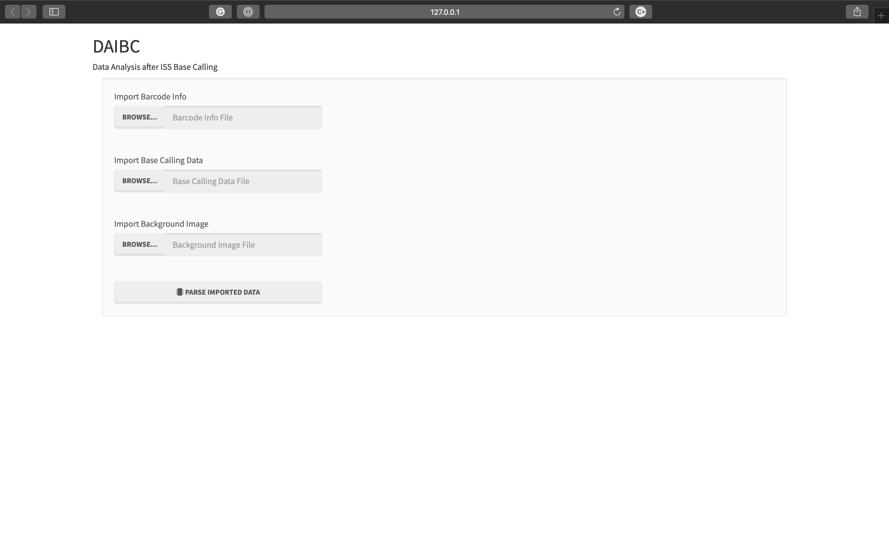
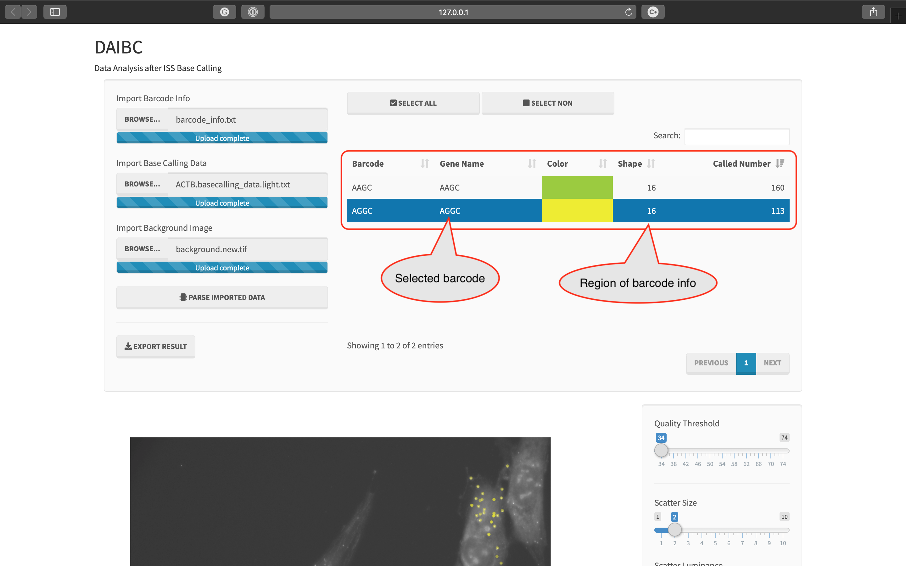

# DAIBC
###### Data Analysing after *In situ* sequencing Base Calling
###### (R + shiny version)

---

## Introduction

This software is used to analyze the results of pyIRIS by importing barcode info file and the two result files of 
pyIRIS.

---

## Installation
### Development environments that passed our test

* macOS 10.14.x
* CentOS 6.x and 7.x
* Ubuntu 16.04.x and 18.04.x
* R 3.5.x (Rstudio 1.2.x or Rstudio Server)

### Installing R models

We suggest to install following models, like:

	install.packages('shiny')
	install.packages('shinyWidgets')
	install.packages('shinythemes')
	install.packages('DT')
	install.packages('hash')
	install.packages('tiff')
	install.packages('grid')
	install.packages('ggplot2')
	install.packages('Cairo')
	install.packages('rsconnect')

### Online published version

We published our DAIBC on: https://yuhao819.shinyapps.io/DAIBC/

### The initial user interface of DAIBC

---

## The file format of imported files
### The format of barcode info file

This file should be prepared by manual with a format like following, of which, the 1st field means barcode sequence, 
and the 2nd one means gene info. **DON'T INSERT ANY SPACE CHARACTER INTO GENE INFO**:

    AACA    SOX2
    AGTC    BIRC5
    GTCA    SCUBE2
    AACT    KLF4
    AGCT    CCNB1
    GCAT    ACTB
    AACG    TP53
    ACTG    MYBL2
    GCTA    GAPDH
    TGAC    HER2
    CTGA    VIM

### The format of result files of pyIRIS

See 'README.1.pyIRIS.md' for detail.

---

## Usage
### Import the barcode info file and the result files of pyIRIS

* Your need re-click the button of 'PARSE IMPORTED DATA' if any of input file has been updated

### Choose barcodes which need to be imaged

### Adjust parameters for visualization

* In control region:
    * 
