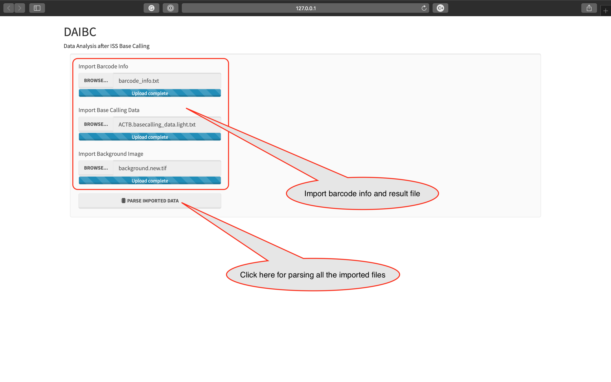
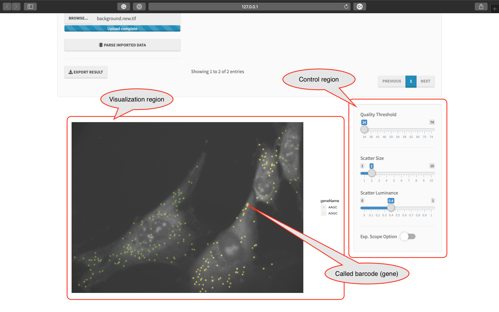
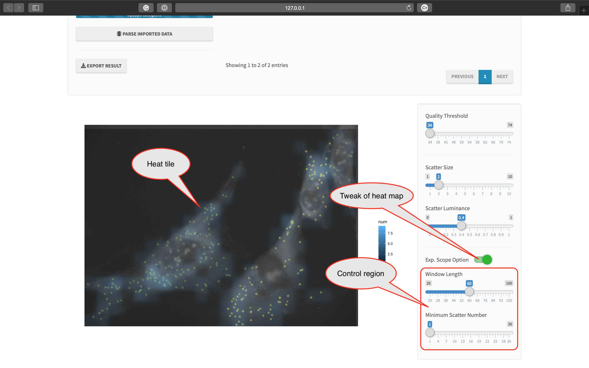

# DAIBC
###### Data Analysing after *In situ* sequencing Base Calling
###### (R + shiny version)

---

## Introduction

This software is used to visualize the results of pyIRIS by importing barcode info file and the two result files of 
pyIRIS.

---

## Installation
### Development environments that passed our test

* macOS 10.14.x
* CentOS 6.x and 7.x
* Ubuntu 16.04.x and 18.04.x
* R 3.5.x (Rstudio 1.2.x or Rstudio Server)

### Installing R models

DAIBC requires the following packages:

	install.packages('shiny')
	install.packages('shinyWidgets')
	install.packages('shinythemes')
	install.packages('DT')
	install.packages('hash')
	install.packages('tiff')
	install.packages('grid')
	install.packages('ggplot2')
	install.packages('Cairo')
	install.packages('rsconnect')

### Online published version

We publish DAIBC on: https://yuhao819.shinyapps.io/DAIBC/

### The initial user interface of DAIBC

---

## The file format of imported files
### The format of barcode info file

This file should be prepared manually with the 1st field indicating barcode sequence, and the 2nd one indicating its 
gene name. **DON'T INSERT ANY SPACE CHARACTER INTO GENE INFO**:

    AACA    SOX2
    AGTC    BIRC5
    GTCA    SCUBE2
    AACT    KLF4
    AGCT    CCNB1
    GCAT    ACTB
    AACG    TP53
    ACTG    MYBL2
    GCTA    GAPDH
    TGAC    HER2
    CTGA    VIM

You could also predefine color and shape for each gene/barcode at the 3rd and 4th columns, respectively. Shape 
index can be set according to https://www.datanovia.com/en/blog/ggplot-point-shapes-best-tips/

    AACA    SOX2    red     0
    AGTC    BIRC5   orange  0
    GTCA    SCUBE2  yellow  0
    AACT    KLF4    green   0
    AGCT    CCNB1   cyan    0
    GCAT    ACTB    blue    0
    AACG    TP53    purple  0
    ACTG    MYBL2   red     1
    GCTA    GAPDH   orange  1
    TGAC    HER2    yellow  1
    CTGA    VIM     green   1

### The format of result files of pyIRIS

See 'README.1.pyIRIS.md' for detail.

---

## Usage
### 1. Import the barcode info file and the result files of pyIRIS

* Your need click the button 'PARSE IMPORTED DATA' again to refresh the plot if any of input file is changed

### 2. Choose barcodes which need to be visualized

### 3.1. Adjust parameters for visualization

* In control panel:
    * 'Quality Threshold' is based on Phred+ 33 score system. For example, value 53 means Q20 and value 63 means Q30
    * 'Scatter Size' means how large a blob is plotted. The value indicates the radius of each blob
    * 'Scatter Luminance' means transparency of the blobs

### 3.2. Calculate the density of scatter of blobs (optional)

* In control panel:
    * 'Window Length' means the window size of each tile
    * 'Minimum Scatter Number' means the minimum number of transcripts used in visibilizing a tile
    
### 4. Export illustration into a PDF file

